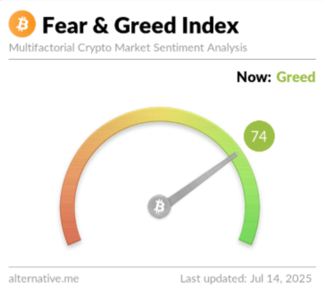
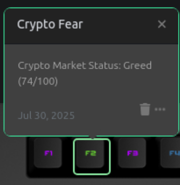

# Q Applet: Crypto Fear and Greed (FNG) Index

This applet displays the daily Fear & Greed Index for Bitcoin and major cryptocurrencies, a single number distilled from market sentiment and emotional signals gathered across the crypto ecosystem.

## 🧠 What Is the Fear & Greed (FNG) Index?

The **Fear & Greed (FNG) Index** measures crypto market emotions, from panic-driven selling to euphoric buying.  
Use this applet to stay emotionally grounded in your crypto decisions – without lifting a finger!

## ⚠️ Disclaimer

This applet is for informational and educational purposes only.  
**It does not constitute investment advice.**  
Always do your own research and consult with a financial advisor before making any investment decisions.

## 📊 Applet Features

- 🔴 **Red glow** when sentiment is **Extreme Fear**
- 🟠 **Orange glow** for **Fear**
- 🟡 **Yellow glow** for **Neutral**
- 🟢 **Green glow** for **Greed**
- 💚 **Bright green glow** for **Extreme Greed**
- 📡 Powered by real-time data from [alternative.me](https://alternative.me/crypto/fear-and-greed-index/)

## ⚙️ Setup Instructions

1. **Install this applet** in the Das Keyboard Q software
2. **Assign the applet to any key** on your keyboard
3. Watch the key light up based on today’s market sentiment!

## Example

Crypto Fear and Greed (FNG) Index on the F3 key.

 Index")

## Changelog

[CHANGELOG.MD](CHANGELOG.md)

## Installation

Requires a Das Keyboard Q series: www.daskeyboard.com

Installation, configuration and uninstallation of applets is done within
the Q Desktop application (<https://www.daskeyboard.com/q>)

## Running tests

    yarn test

## Contributions

Pull requests welcome.
